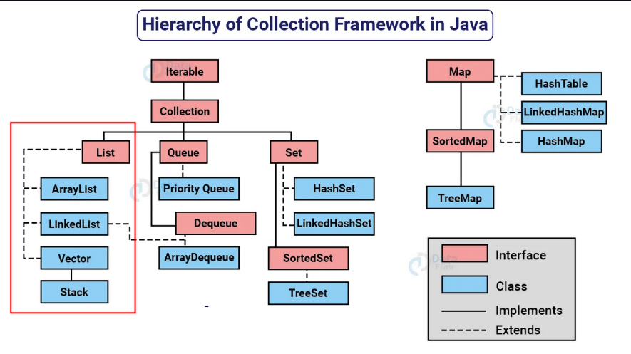

- A interface `List` é uma coleção **ordenada** que permite a **inclusão de elementos duplicados**.
- É um dos tipos de coleção mais utilizados em Java, e as classes de implementação comuns são `ArrayList` e `LinkedList`.
- A `List` se assemelha a uma **matriz com comprimento dinâmico**, permitindo **adicionar ou remover elementos**.
- A interface `List` fornece métodos úteis para:
    - Adicionar elementos em posições específicas,
    - Remover ou substituir elementos com base no índice,
    - Obter sublistas usando índices.
- A classe `Collections` fornece algoritmos úteis para manipulação de `List`, como:
    - `sort` (ordenação),
    - `shuffle` (embaralhamento),
    - `reverse` (reversão),
    - `binarySearch` (busca binária).

---

### `ArrayList`
- O `ArrayList` é uma implementação da interface `List` que armazena os elementos em uma **estrutura de array redimensionável**.
- Pode crescer automaticamente à medida que novos elementos são adicionados.
- **Vantagem:** acesso rápido aos elementos por meio de **índices** (eficiente para leitura).
- **Desvantagem:** adicionar ou remover elementos no meio da lista pode ser **mais lento**, pois exige realocação.

---

### `LinkedList`
- O `LinkedList` é uma implementação da interface `List` que usa uma **lista duplamente encadeada**.
- Cada elemento aponta para o anterior e o próximo.
- **Vantagem:** eficiente para **inserções ou remoções** no início ou fim da lista.
- **Desvantagem:** **acesso por índice é mais lento**, pois precisa percorrer os elementos.

---

### `Vector`
- O `Vector` é uma implementação **antiga** da interface `List`, semelhante ao `ArrayList`, porém é **sincronizado** (thread-safe).
- **Vantagem:** pode ser usado em **ambientes com múltiplas threads**.
- **Desvantagem:** a sincronização **traz sobrecarga de desempenho**.
- **Uso moderno:** pouco utilizado hoje, sendo o `ArrayList` preferido quando não há necessidade de sincronização.
