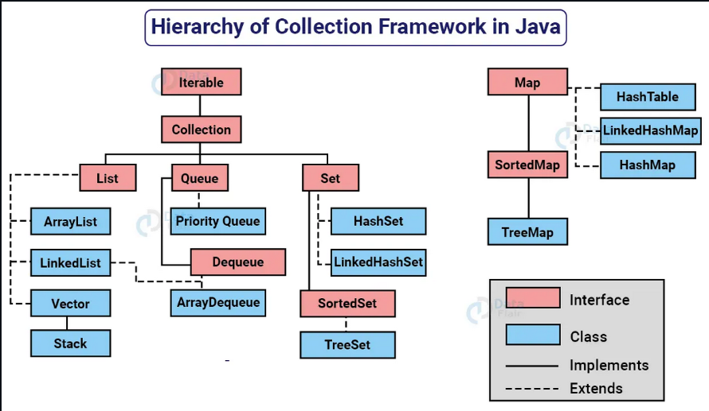
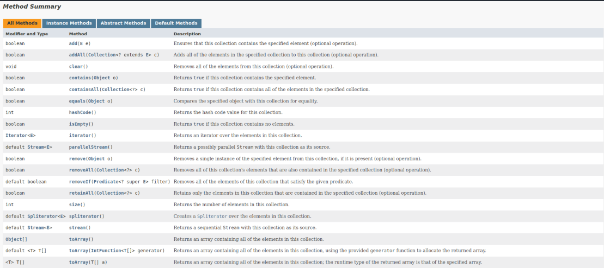

Collection Framework API
Uma coleção (collection) é uma estrutura de dados que serve para agrupar muitos elementos em uma única unidade; estes elementos precisam ser objetos.
Uma Collection pode ter coleções homogêneas e heterogêneas, normalmente utilizamos coleções homogêneas de um tipo específico.
O núcleo principal das coleções é formado pelas interfaces da figura abaixo; essas interfaces permitem manipular a coleção independentemente do nível de detalhe que elas representam.
Temos quatro grandes tipos de coleções: List (lista), Set (conjunto), Queue (fila) e Map (mapa). A partir dessas interfaces, temos muitas subclasses concretas que implementam várias formas diferentes de se trabalhar com cada coleção.

- Todas as interfaces e classes são encontradas dentro do pacote (package) java.util.
- Embora a interface Map não seja filha direta da interface Collection, ela também é considerada uma coleção devido à sua função.

https://docs.oracle.com/en/java/javase/17/docs/api/java.base/java/util/Collection.html