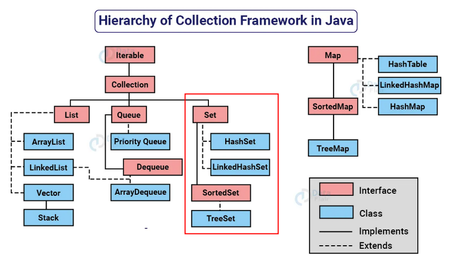

- A interface Set é uma coleção que não pode conter elementos duplicados.
Essa interface representa o conceito matemático de um conjunto e é usada para representar conjuntos, como um baralho de cartas.
- A plataforma Java possui três implementações de Set de uso geral: HashSet, TreeSet e LinkedHashSet.
- A interface Set não permite acesso aleatório a um elemento na coleção.
Para percorrer os elementos de um Set, você pode usar um iterador ou um loop foreach.

- HashSet: O HashSet é uma implementação da interface Set que armazena os elementos em uma tabela hash. Ele não mantém uma ordem específica dos elementos. A principal vantagem do HashSet é que ele oferece um desempenho de busca muito eficiente, pois usa funções hash para indexar os elementos. No entanto, a ordem em que os elementos são adicionados pode não ser preservada ao percorrer o conjunto.
- TreeSet: O TreeSet é uma implementação da interface Set que armazena os elementos em uma árvore binária balanceada. Isso significa que os elementos são armazenados em uma ordem classificada e são mantidos automaticamente em ordem crescente. A principal vantagem do TreeSet é que os elementos são sempre retornados na ordem classificada, o que facilita a obtenção de elementos em uma determinada ordem. No entanto, a busca e a inserção são um pouco mais lentas em comparação com o HashSet.
- LinkedHashSet: O LinkedHashSet é uma implementação da interface Set que mantém a ordem de inserção dos elementos, além de usar uma tabela hash para obter um bom desempenho de busca. Ele é semelhante ao HashSet, mas também mantém uma lista duplamente vinculada que preserva a ordem de inserção. Isso permite que os elementos sejam percorridos na ordem em que foram adicionados. O LinkedHashSet é útil quando você precisa manter a ordem de inserção dos elementos e também ter um bom desempenho de busca.
